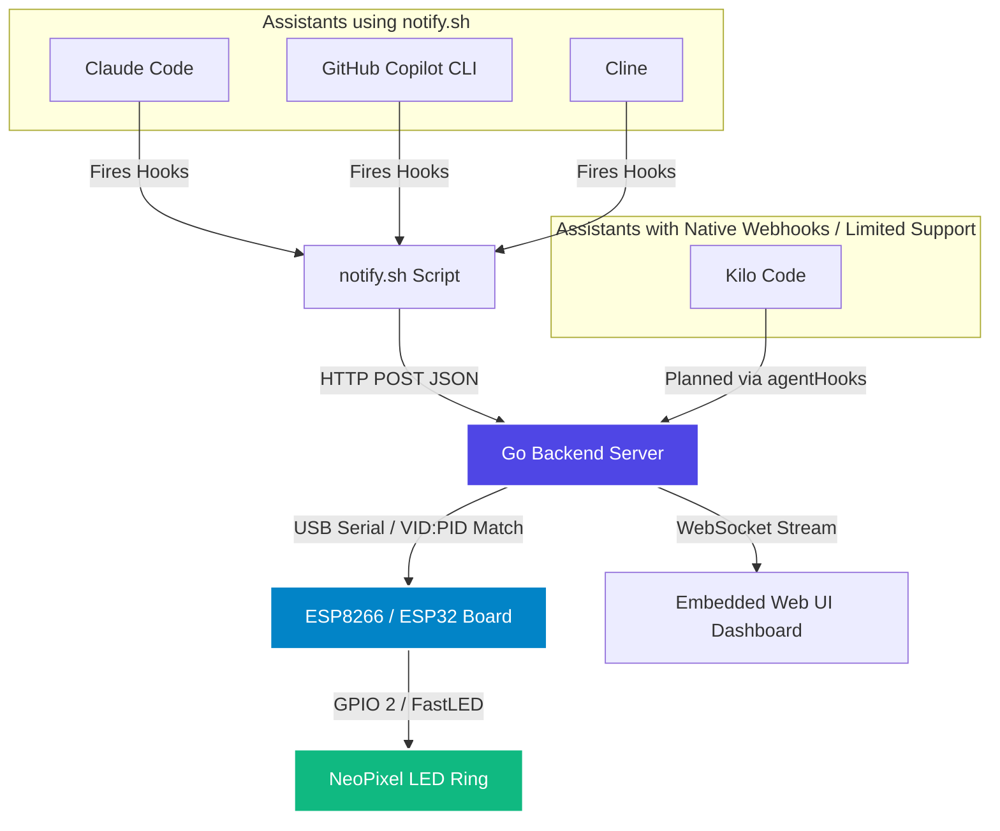

# Geeky-AI-Progress

# AI Agent LED Ring Monitor

An IoT and software telemetry bridge that connects your favorite AI coding assistants (**Claude Code**, **GitHub Copilot CLI**, **Cline**, and **Kilo Code**) to a physical **NeoPixel LED ring** driven by an ESP8266 microcontroller, accompanied by a real-time web dashboard.

---

## Architecture Overview


---

## Prerequisites

- **Go 1.22+** (for building the backend server)
- **Docker** (optional, for cross-compilation or Arduino builds)
- **PlatformIO** or **Arduino IDE** (for flashing ESP8266)
- **jq** (required by `setup-hooks.sh` for payload parsing)
- **NodeMCU v2 (ESP8266)** board with a 24-LED NeoPixel ring

---

## Project Structure

```
.
├── Monitor_sever/
│   ├── main.go                # Go backend server (Serial comms, WebSockets, REST API)
│   └── go.mod
├── Nodemcu_8266/
│   ├── platformio.ini         # PlatformIO config for NodeMCU v2 (ESP8266)
│   ├── src/main.ino           # FastLED sketch for 24-LED NeoPixel ring
│   ├── Dockerfile             # Docker build environment for Arduino/PlatformIO
│   └── build-arduino.sh       # Docker-based Arduino build script
├── build.sh                   # Cross-compilation build script for Go binaries (replaces Makefile)
├── setup-hooks.sh             # Automated multi-agent hook installer and uninstaller
└── templates/
    └── index.html             # Embedded real-time web dashboard (compiled into Go binary)
```

---

## Quick Start Guide

### 1. Build the Go Backend Server

Use the provided build script to compile statically linked binaries for your environment:

```bash
chmod +x build.sh
./build.sh
```

This builds both Linux and Windows binaries into the `dist/` directory. Alternatively, build individually:

```bash
./build.sh linux
./build.sh windows
```

To clean build artifacts:

```bash
./build.sh clean
```

To run the server directly without cross-compilation:

```bash
cd Monitor_sever
go mod download
go run main.go
```

The server starts on `http://0.0.0.0:5000`.

### Optional: Remote SSH Reverse Tunnel

The server supports a `-remote` flag to automatically establish an SSH reverse tunnel to a remote host:

```bash
cd Monitor_sever
go run main.go -remote 192.168.1.50:5000
```

This opens port `5000` on the remote host and forwards all traffic back to the local server at `localhost:5000`. Authentication follows this order:

1. SSH agent (`SSH_AUTH_SOCK`)
2. Private keys in `~/.ssh/id_ed25519`, `~/.ssh/id_ecdsa`, `~/.ssh/id_rsa`
3. Interactive password prompt if key-based auth fails

Remote clients can then POST events to `http://192.168.1.50:5000/api/agent/event`.

---

### 2. Flash the ESP Microcontroller

Upload the ESP8266 FastLED sketch to your NodeMCU board using PlatformIO or the Arduino IDE:

- **Board**: NodeMCU v2 (ESP8266)
- **Data Pin**: GPIO 2 (D4 on NodeMCU)
- **Power**: Connect to a dedicated 5V external power supply with a common ground (GND) tied to the ESP

**Using PlatformIO directly:**

```bash
cd Nodemcu_8266
pio run -t upload
```

**Using the Docker build script:**

```bash
cd Nodemcu_8266
bash build-arduino.sh /dev/ttyUSB0   # Linux
bash build-arduino.sh COM3           # Windows
```

---

### 3. Configure Global AI Agent Hooks

Run the setup script to generate `notify.sh` and patch your global editor/cli settings. It will auto-detect your local network IP:

```bash
chmod +x setup-hooks.sh
./setup-hooks.sh
```

If your Go server runs on a different machine or specific IP, provide it explicitly using the `--url` flag:

```bash
./setup-hooks.sh --url 192.168.1.150:5000
```

---

## API Schema

### Endpoint: `POST /api/agent/event`

Accepts JSON payloads from AI agent hooks. If `session_id` is omitted, events are grouped under `default-session`.

#### Request Body

```json
{
  "source": "claude",
  "event_type": "pre_tool_use",
  "session_id": "abc-123",
  "tool_name": "read_file",
  "tools": ["read_file", "write_file"],
  "toolsets": ["file-editing", "navigation"],
  "hostname": "nbm-venus",
  "user": "nbmai"
}
```

#### Fields

| Field | Type | Required | Description |
|-------|------|----------|-------------|
| `source` | `string` | No | AI agent identifier. Examples: `claude`, `copilot`, `cline`, `kilo`. Defaults to `unknown`. |
| `event_type` | `string` | No | Lifecycle event. Examples: `session_start`, `pre_tool_use`, `session_end`, `tool`, `edit`, `work`, `running`, `complete`, `stop`, `end`. Defaults to `unknown`. |
| `session_id` | `string` | No | Unique session identifier. If omitted, defaults to `default-session`. |
| `tool_name` | `string` | No | Name of the tool being invoked. Sent by `notify.sh` but not used by the backend for state decisions. Defaults to `unknown`. |
| `tools` | `array[string]` | No | List of available tools from the agent context. Defaults to `["unknown"]`. |
| `toolsets` | `array[string]` | No | List of active toolsets/categories from the agent context. Defaults to `["unknown"]`. |
| `hostname` | `string` | No | Hostname of the machine sending the event. Auto-detected by `notify.sh` or sent by the agent. Defaults to `unknown`. |
| `user` | `string` | No | Username of the user running the agent. Auto-detected by `notify.sh` or sent by the agent. Defaults to `unknown`. |

#### Event Type Mapping

| Event Type Pattern | Status | Color | Animation |
|--------------------|--------|-------|-----------|
| `tool`, `pre`, `edit`, `work`, `running` | Working | Amber/Gold `[245, 158, 11]` | Bounce (ping-pong dot) |
| `complete`, `stop`, `end` | Completed | Emerald Green `[16, 185, 129]` | Pulse |
| `session_start` or any other | Started | Indigo `[99, 102, 241]` | Pulse |
| No active sessions | Idle | Breathing Cyan `[0, 100, 150]` | Breathing |

#### Response

```json
{
  "status": "success"
}
```

---

### WebSocket: `WS /ws`

Broadcasts `SessionEvent` updates to connected dashboard clients in real time.

#### Message Format

```json
{
  "source": "claude",
  "event_type": "pre_tool_use",
  "status_text": "Working",
  "color": [245, 158, 11],
  "timestamp": "14:23:05",
  "session_id": "abc-123",
  "tool_name": "read_file",
  "tools": ["read_file", "write_file"],
  "toolsets": ["file-editing", "navigation"],
  "hostname": "nbm-venus",
  "user": "nbmai"
}
```

---

## Serial Payload (ESP8266)

The Go server sends newline-delimited JSON to the ESP8266 over USB Serial at **115200 baud**.

### Payload Schema

```json
{
  "total_leds": 24,
  "segments": [
    {
      "start": 0,
      "end": 5,
      "color": [99, 102, 241],
      "dotColor": [255, 220, 0],
      "animation": "bounce"
    }
  ]
}
```

#### Fields

| Field | Type | Description |
|-------|------|-------------|
| `total_leds` | `integer` | Total LED count in the ring. Currently fixed at `24`. |
| `segments` | `array` | List of LED segments, one per active session. |
| `segment.start` | `integer` | Start index of the segment (0-based). |
| `segment.end` | `integer` | End index of the segment (inclusive). |
| `segment.color` | `[r, g, b]` | Background RGB color for the segment. |
| `segment.dotColor` | `[r, g, b]` | RGB color for the animated dot. |
| `segment.animation` | `string` | Animation type: `breathing`, `pulse`, `bounce`, `running`, `crawler`, or `solid`. |

### Animation Behavior on Firmware

- **`breathing`**: Smooth sine-wave brightness variation (idle mode).
- **`pulse`**: Sine-wave brightness scaled between 25% and 100%.
- **`bounce` / `pingpong`**: A single dot moves back and forth within the segment.
- **`running` / `crawler`**: A single dot moves forward and wraps around the segment.
- **`solid`**: Static background color with no animation.
- **Fallback**: Any unrecognized animation renders as a solid color fill.

---

## LED Ring Behavior

- **24-LED Ring**: The server and firmware are both configured for a 24-LED ring.
- **Session Division**: When multiple sessions are active, the ring is divided evenly (one contiguous segment per session).
- **Grace Period**: Completed sessions remain on the ring for 30 seconds before being pruned.
- **Inactivity Timeout**: Sessions with no updates for 30 minutes are automatically removed.
- **Idle State**: When no sessions are active, the entire ring shows a breathing cyan animation.

---

## Management & Cleanup

To completely remove all added configurations, restore original JSON backups (`settings.json`, `led-monitor.json`, `kilo.jsonc`), and delete generated notification scripts, run:

```bash
./setup-hooks.sh -c
```

---

## Hardware Wiring Reference

| NeoPixel Ring Pin | ESP8266 / NodeMCU Pin | Description |
|-------------------|-----------------------|-------------|
| DIN               | GPIO 2 (D4)           | Data control line |
| GND               | GND                   | Common Ground (Must tie power supply & board grounds together) |
| 5V                | External 5V PSU (+)   | Dedicated power source (do not power full rings directly from board pins) |
